:::
GRAPHICAL USER INTERFACE:
======================================================================
-------------------------------------------------------

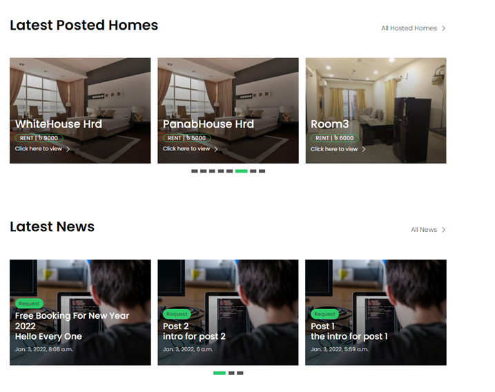

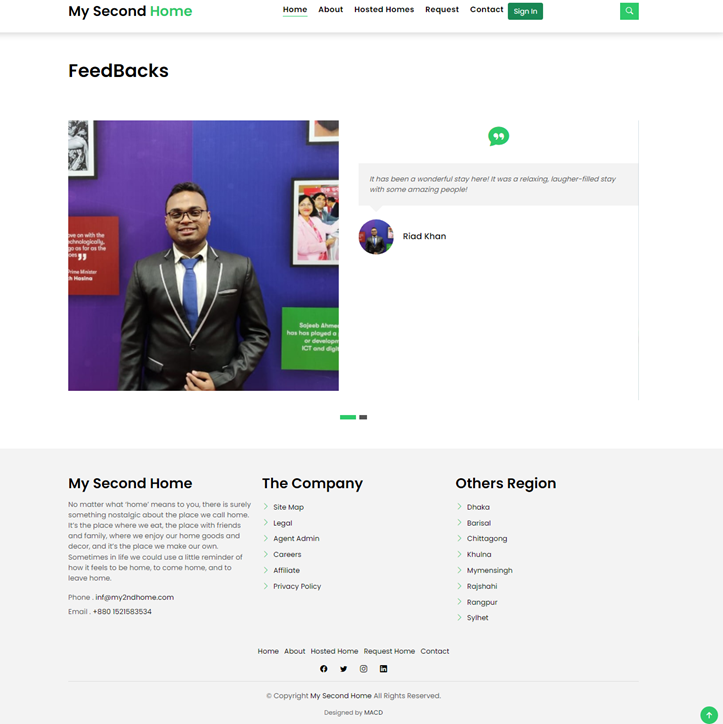

\

 

LOG IN PAGE:
---------------------------------------------------------

 

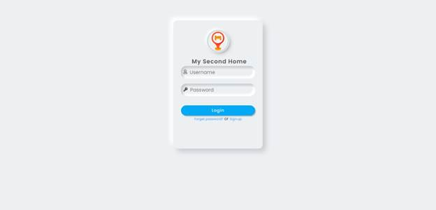

 
-----------------------------

SIGN UP PAGE:
---------------------------------------------------------------------------------------

 

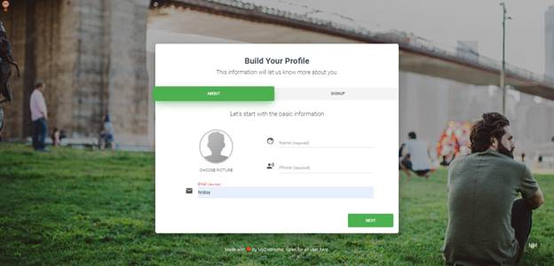
 

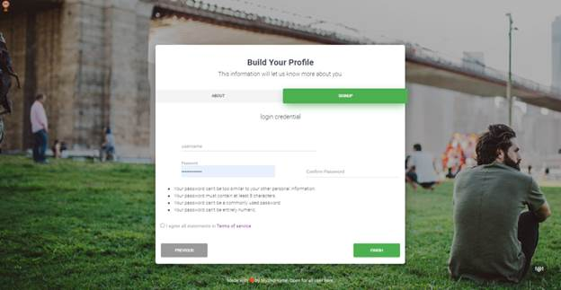

 

HOSTED HOMES:
---------------------------------------------------------------------------------------

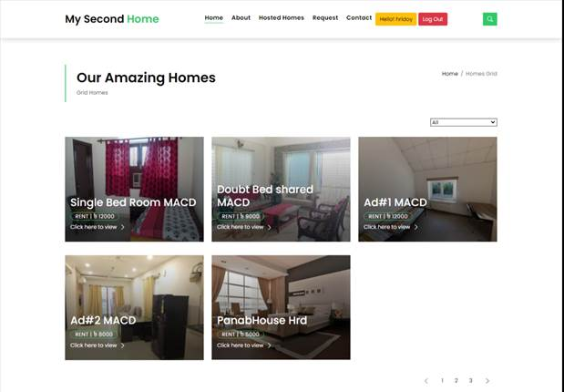

SEARCH HOMES:
----------------------------------------------------------
 

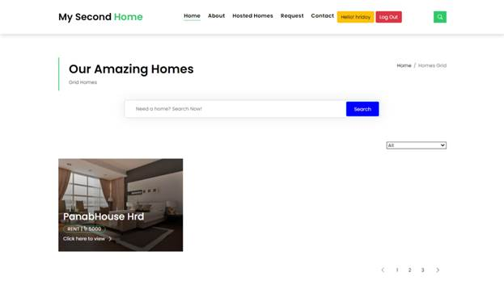

 

HOME DETAILS:
----------------------------------------------------------

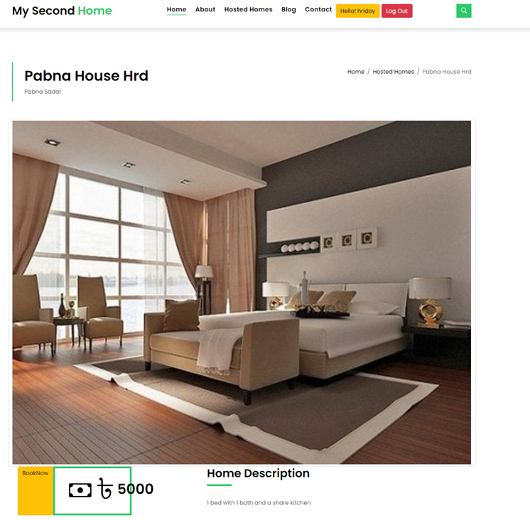
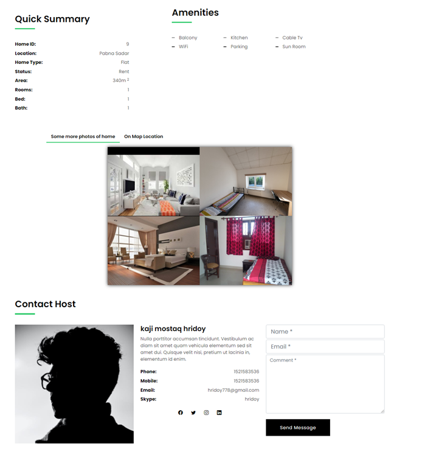{#Picture 21 width="717" height="751"}

 

BOOK HOME (PAYMENT):
----------------------------------------------------------------------------------------------
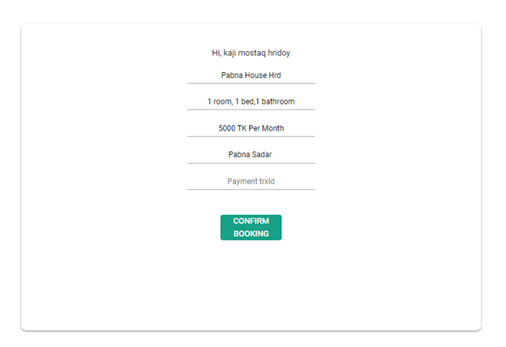

 

USER PROFILE (GENERAL USER):
-------------------------------------------------------------------------

 

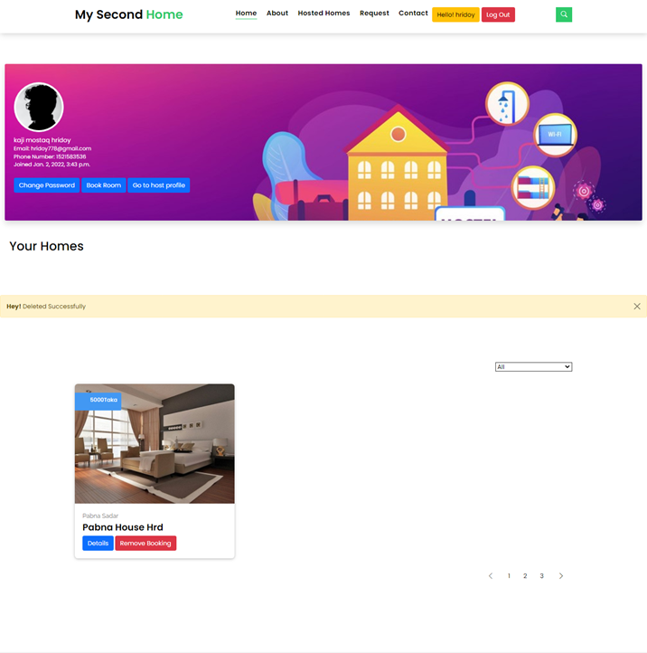

 
HOST PROFILE:
----------------------------------------------------------
 

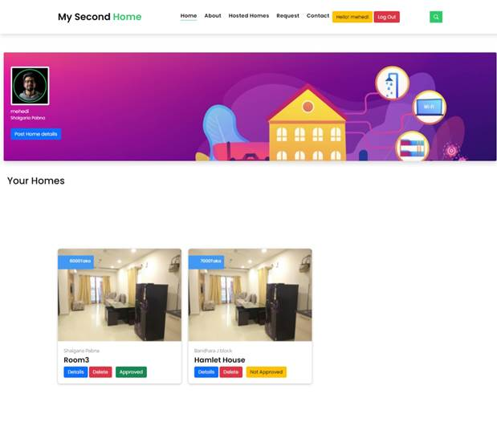

ADMIN PANEL:
---------------------------------------------------------

 

### ADMIN DASHBOARD:

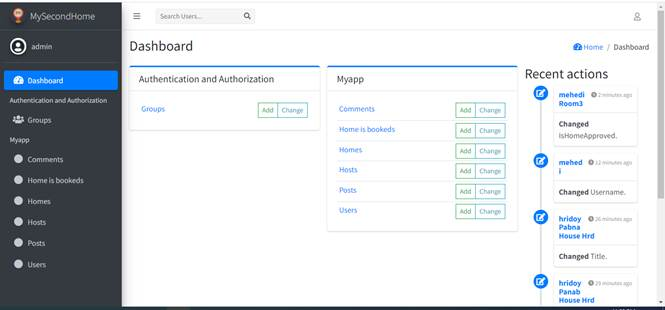

 

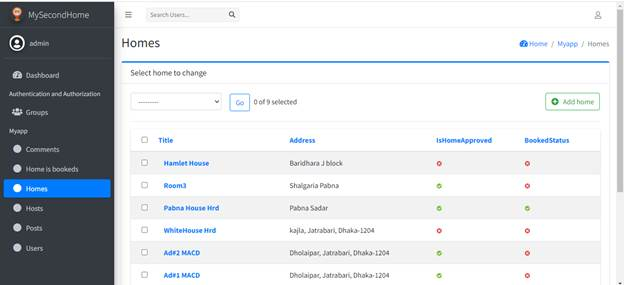

 

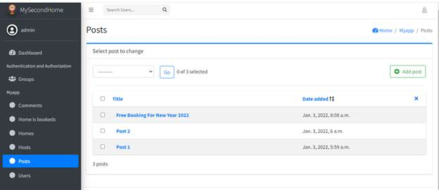

 

### ADMIN HOME APPROVAL (ADMIN PROFILE):

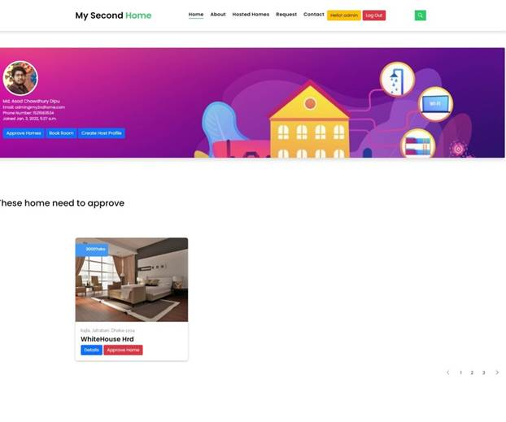

ABOUT PAGE:
--------------------------------------------------------

 

 

CONTACT PAGE:
---------------------------------------------------------------------------------------

 

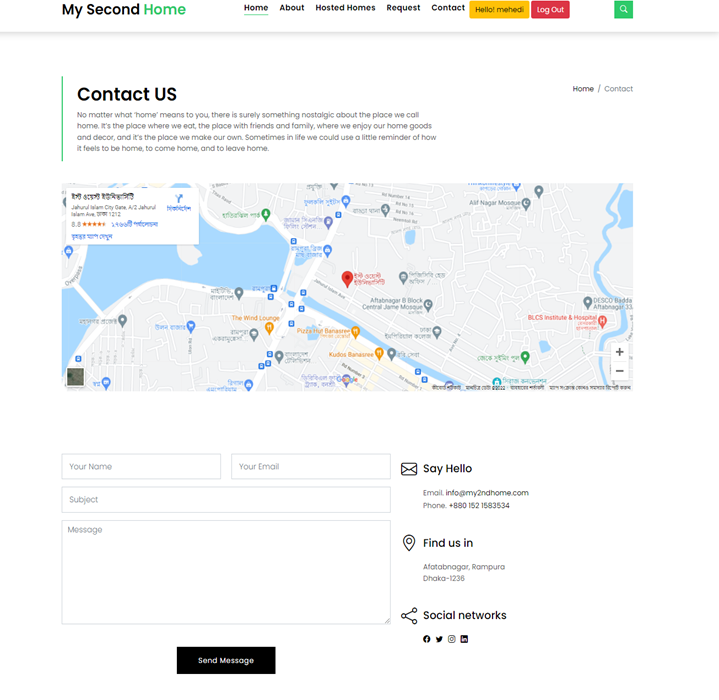

 

REQUEST PAGE:
----------------------------------------------------------

 

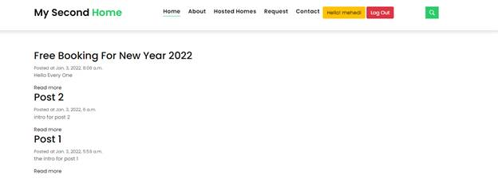

 

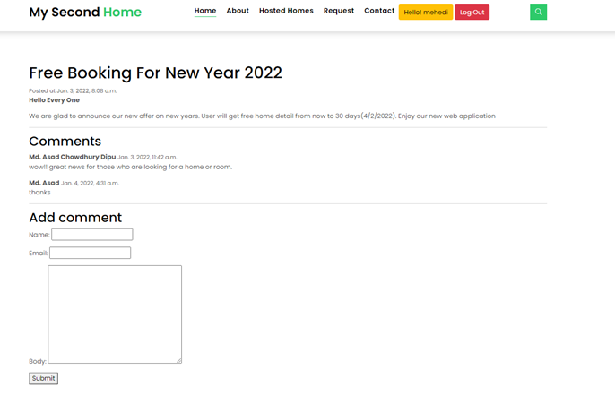

CHANGE PASSWORD:
--------------------------------------------

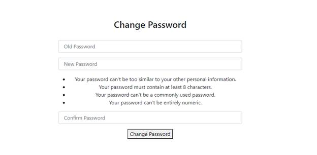
:::
